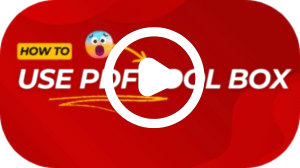

# PDF Toolbox 🧰

Developed by Muhammad Asad in Python using Streamlit and pypdf (primarily), PDF Toolbox is a versatile web application designed to streamline your PDF workflows.  This tool empowers users to perform a wide array of operations on PDF files, including merging, splitting, encrypting, decrypting, editing metadata, and converting images to PDFs. The addition of stamping and watermarking capabilities makes it a truly comprehensive solution for efficient PDF document management.

## Table of Contents 📖

1. [Installation](#installation)
2. [Usage](#usage)
3. [Features](#features)
4. [Contributing](#contributing)
5. [License](#license)
6. [Contact Information](#contact-information)
7. [Acknowledgments](#acknowledgments)

## 1. Installation 🚀

Get up and running with PDF Toolbox in a few easy steps:

*   **Clone the repository:**
    ```bash
    git clone https://github.com/Asad-Ali-Rana/PDF-ToolBox.git
    cd pdf-toolbox
    ```
*   **Create a virtual environment (recommended):**
    ```bash
    python -m venv venv
    source venv/bin/activate  # On Windows use venv\Scripts\activate
    ```
*   **Install dependencies:**
    ```bash
    pip install -r requirements.txt
    ```
*   **Run the application:**
    ```bash
    streamlit run app.py
    ```

## 2. Usage 💡

Using PDF Toolbox is straightforward:

*   **Launch:** Execute `streamlit run app.py`.
*   **Access:** Open the web interface in your browser (usually at `http://localhost:8501`).
*   **Choose an operation:** Select the desired action from the menu:
    *   **Merge PDFs:** Combine multiple PDF files into a single document.
    *   **Split PDFs:** Extract specific pages from a PDF file.
    *   **Encrypt/Decrypt PDFs:** Secure your PDFs with passwords or remove existing encryption.
    *   **Edit Metadata:** Modify or remove metadata associated with your PDFs.
    *   **Image to PDF Conversion:** Convert images into PDF documents.
    *   **Add Watermarks/Stamps:** Apply custom watermarks or stamps to your PDFs.

*   **Visual Guide:** A usage video is available in the `assets` folder.

## How To use PDF ToolBox?    

[](https://vimeo.com/1054559283?share=copy#t=0)

## 3. Features ✨

PDF Toolbox boasts a rich set of features:

*   **PDF Manipulation:** Merge and Split PDFs with ease.
*   **Security:** Encrypt and Decrypt PDFs to protect sensitive information.
*   **Metadata Management:** Edit, View, and Remove Metadata.
*   **Image Conversion:** Convert Images to PDFs seamlessly.
*   **Branding:** Add Watermarks or Stamps for branding or identification.

## 4. Contributing 🤝

We welcome contributions!  To contribute to PDF Toolbox, please follow these guidelines:

1.  **Fork:** Fork the repository.
2.  **Branch:** Create a new branch for your feature or bug fix.
3.  **Code:** Implement your changes and commit them with clear and concise messages.
4.  **Push:** Push your changes to your forked repository.
5.  **Pull Request:** Submit a pull request.

## 5. License 📜

This project is licensed under the Apache 2.0 License - see the [LICENSE](LICENSE) file for details.

## 6. Contact Information 📧

For inquiries, suggestions, or feedback, please contact Muhammad Asad:

*   Email: asad12334ali@gmail.com
*   GitHub: [https://github.com/Asad-Ali-Rana](https://github.com/Asad-Ali-Rana)

## 7. Acknowledgments 🙏

We extend our sincere gratitude to the pypdf and Streamlit communities for their invaluable tools and resources that made this application possible.

Thanks for Reading ❤️
